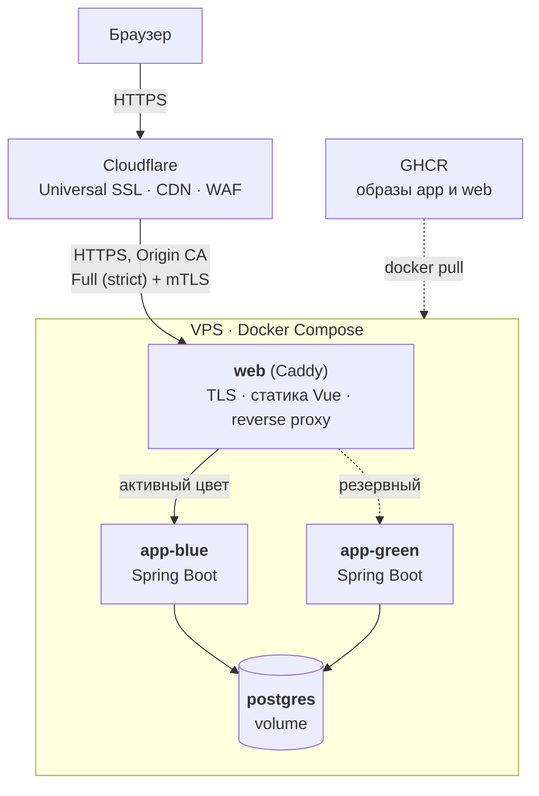
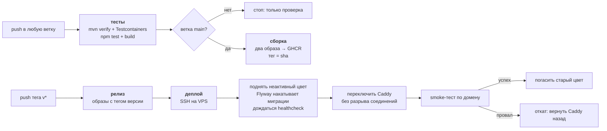

# Subscription Monitor

Веб-приложение для мониторинга персональных подписок с автоматическими уведомлениями, обработкой платежей и полностью автоматизированным циклом сборки, тестирования и развёртывания.

Первая версия проекта (курсовая работа) — Spring Boot REST API с десктопным Swing-клиентом — зафиксирована тегом [`coursework-2025`](../../tree/coursework-2025). Текущая версия заменяет десктопный клиент на веб-интерфейс и добавляет контейнеризацию с CI/CD.

## Оглавление

- [Описание проекта](#описание-проекта)
- [Архитектура](#архитектура)
- [База данных](#база-данных)
- [REST API](#rest-api)
- [Обработка исключений](#обработка-исключений)
- [Безопасность и роли пользователей](#безопасность-и-роли-пользователей)
- [Автоматизация и планировщики](#автоматизация-и-планировщики)
- [Веб-интерфейс](#веб-интерфейс)
- [Тестирование](#тестирование)
- [CI/CD и развёртывание](#cicd-и-развёртывание)
- [Логирование](#логирование)
- [Быстрый старт](#быстрый-старт)
- [Структура проекта](#структура-проекта)

## Описание проекта

**Subscription Monitor** — приложение для управления персональными подписками с автоматическим мониторингом предстоящих платежей.

### Ключевые возможности

- Управление подписками с поддержкой различных валют (RUB, USD, EUR)
- Автоматические уведомления о предстоящих и выполненных платежах
- Категоризация подписок (системные, пользовательские и устаревшие категории)
- Аналитика расходов с нормализацией к месячным тратам
- Автоматическая обработка просроченных платежей
- REST API с документацией Swagger
- Веб-интерфейс на Vue 3
- Ролевая модель доступа (USER, ADMIN)
- Автоматические сборка, тестирование и выкатка на сервер по тегу версии

### Стек технологий

- **Backend**: Java 24, Spring Boot 3.4.2, Spring Security, Spring Data JPA, Flyway
- **База данных**: PostgreSQL 17
- **Frontend**: Vue 3, Vite, Vue Router, Pinia, Element Plus, Axios
- **REST API**: Spring Web, SpringDoc OpenAPI (Swagger UI)
- **Тестирование**: JUnit 5, Mockito, Testcontainers, Vitest
- **Инфраструктура**: Docker, Docker Compose, Caddy, GitHub Actions, GHCR, Cloudflare
- **Безопасность**: BCrypt, сессионная аутентификация, CSRF-защита

## Архитектура

### Архитектура развёртывания



Проект собирается в два Docker-образа:

| Образ | Содержимое | Базовый образ |
|-------|------------|---------------|
| `subscription-monitor-app` | Spring Boot приложение, разложенное на слои | `eclipse-temurin:24-jre` |
| `subscription-monitor-web` | Caddy + собранная статика Vue | `caddy:2-alpine` |

Caddy раздаёт статику и проксирует `/api/*` на активный экземпляр приложения. SPA и API живут на одном домене, поэтому CORS не нужен.

### Модели данных

Все модели наследуют: `id` (UUID), `createdAt` (LocalDateTime)

- **User** — Пользователь системы
    - `username` (String, unique), `email` (String, unique) — уникальные строки
    - `password` (String) — хешированный пароль
    - `role` (UserRole) — роль пользователя
    - `notificationDays` (Integer) — за сколько дней уведомлять

- **Category** — Категория подписки
    - `name` (String) — название категории
    - `type` (CategoryType) — тип категории
    - `createdByUserId` (UUID, nullable) — создатель

- **Payment** — Информация о платеже
    - `cost` (BigDecimal) — стоимость
    - `currency` (Currency) — валюта
    - `billingPeriodDays` (Integer) — период оплаты в днях
    - `nextBillingDate` (LocalDate) — дата следующего списания

- **Subscription** — Подписка пользователя
    - `userId` (UUID), `categoryId` (UUID) — связи
    - `name` (String) — название подписки
    - `payment` (Payment) — объект Payment
    - `isActive` (Boolean) — активна ли подписка

- **Notification** — Уведомление о платеже
    - `userId` (UUID), `subscriptionId` (UUID) — связи
    - `notificationDate` (LocalDateTime) — когда уведомить
    - `type` (NotificationType) — тип уведомления
    - `isSent` (Boolean) — отправлено ли уведомление
    - `message` (String) — текст уведомления

### Перечисления (Enums)

| Enum | Значения | Описание |
|------|----------|----------|
| `UserRole` | `USER`, `ADMIN` | Роль пользователя в системе |
| `CategoryType` | `SYSTEM`, `CUSTOM`, `LEGACY` | Тип категории (системная, пользовательская, устаревшая) |
| `Currency` | `RUB`, `USD`, `EUR` | Валюта платежа |
| `NotificationType` | `UPCOMING_PAYMENT`, `PAYMENT_SUCCESSFUL` | Тип уведомления (предстоящий платеж, успешное списание) |

**Реализация в БД:** VARCHAR + CHECK constraints (для совместимости с JPA/Hibernate)

### Связи между сущностями

| Сущности                       | Тип связи | Поле связи | Особенности                                     |
|--------------------------------|-----------|------------|-------------------------------------------------|
| `User`, `Subscription`         | 1:N | `Subscription.userId` | Один пользователь ↔ много подписок              |
| `Category`, `Subscription`     | 1:N | `Subscription.categoryId` | Одна категория ↔ много подписок                 |
| `Subscription`, `Payment`      | 1:1 | `Subscription.payment` | Один платеж ↔ одна подписка                     |
| `User`, `Notification`         | 1:N | `Notification.userId` | Один пользователь ↔ много уведомлений           |
| `Subscription`, `Notification` | 1:N | `Notification.subscriptionId` | Одна подписка ↔ много уведомлений               |

### Каскадные операции при удалении

| Удаляемая сущность | Связанная сущность | Действие | Механизм реализации |
|--------------------|--------------------|----------|---------------------|
| User | Subscription | Удаляются все подписки пользователя | SQL: ON DELETE CASCADE |
| User | Notification | Удаляются все уведомления пользователя | SQL: ON DELETE CASCADE |
| User | Category (CUSTOM) | Категории сохраняются, но теряют владельца (created_by_user_id = NULL) | SQL: ON DELETE SET NULL |
| Subscription | Payment | Удаляется связанный платеж | JPA: CascadeType.ALL |
| Subscription | Notification | Удаляются все уведомления подписки | SQL: ON DELETE CASCADE |
| Category | Subscription | Удаление запрещено при наличии активных подписок | SQL: ON DELETE RESTRICT |
| Payment | Subscription | Удаляется подписка | SQL: ON DELETE CASCADE |
| Payment | Notification | Удаляются уведомления через каскад от Subscription | SQL: ON DELETE CASCADE |

### Уникальные ограничения

- **Уникальность username и email** — каждый пользователь имеет уникальные логин и адрес электронной почты
- **Уникальность активных подписок** — пользователь не может создать две активные подписки с одинаковым названием

## База данных

Схемой базы данных управляет **Flyway**: версионированные миграции лежат в `backend/src/main/resources/db/migration/` и применяются автоматически при старте приложения. Hibernate работает в режиме `validate` — не меняет схему, а сверяет с ней сущности.

| Миграция | Содержимое |
|----------|------------|
| `V1__create_tables.sql` | Таблицы, ограничения целостности, partial unique индекс активных подписок |
| `V2__create_indexes.sql` | 28 индексов (B-tree, partial, composite, BRIN) |
| `V3__create_views.sql` | 4 аналитические витрины в схеме `analytics` |

Особенности:

- Пустая база превращается в актуальную схему одним стартом приложения — это основа автоматического развёртывания.
- Аналитические витрины (`user_subscriptions_summary`, `upcoming_payments`, `category_statistics`, `user_category_statistics`) используются `AnalyticsService` напрямую через SQL; витрина расходов нормализует стоимость подписок к месячным тратам.
- Тестовые данные создаются через `DataInitializer.java`: системные категории — всегда, административный аккаунт — только если задан пароль (`app.init.admin-password`, в prod — переменная `APP_INIT_ADMIN_PASSWORD`).
- Параметры подключения задаются переменными окружения `DB_URL`, `DB_USERNAME`, `DB_PASSWORD`; значения по умолчанию подходят только для локальной разработки.

## REST API

REST API разделен на 7 групп контроллеров:

| Контроллер | Назначение | Основные операции                                                                                                                                                      |
|------------|------------|------------------------------------------------------------------------------------------------------------------------------------------------------------------------|
| `AuthController` | Аутентификация и регистрация | Вход и выход (сессия), регистрация, получение данных текущего пользователя, смена email, изменение пароля                                                              |
| `UserController` | Управление пользователями | Создание, просмотр, обновление, удаление пользователей <br/>Фильтрация по ролям                                                                                        |
| `CategoryController` | Управление категориями | Создание, просмотр, обновление, удаление категорий <br/> Фильтрация по типам <br/> Контроль доступа для пользовательских категорий                                     |
| `SubscriptionController` | Управление подписками | Создание, просмотр, обновление, удаление подписок <br/> Фильтрация по пользователям, категориям, активности <br/> Атомарное обновление с платежами                     |
| `NotificationController` | Управление уведомлениями | Создание, просмотр, обновление, удаление уведомлений <br/> Фильтрация по пользователям, подпискам, статусу отправки <br/> Получение ожидающих и полученных уведомлений |
| `PaymentController` | Управление платежами | Создание, просмотр, обновление, удаление платежной информации <br/> Фильтрация по валютам                                                                              |
| `AnalyticsController` | Аналитика и статистика | Сводная статистика пользователя (общие расходы, количество подписок), статистика по категориям, предстоящие платежи с индикаторами срочности                           |

### Swagger документация

REST API документирован с помощью **SpringDoc OpenAPI 3** (Swagger UI).

**Адрес:**
```
http://localhost:8080/swagger-ui.html
```

Аутентификация в Swagger — сессионная: выполните `POST /api/auth/login`, браузер сохранит сессионную куку автоматически.

## Обработка исключений

Иерархия исключений построена на трех базовых классах:

| Базовый класс | Наследуется от | Назначение |
|---------------|----------------|------------|
| `BaseException` | `Exception` | Корневой класс с кодом ошибки и аргументами |
| `EntityNotFoundException` | `BaseException` | Базовый класс для NotFound исключений (404) |
| `ValidationException` | `BaseException` | Базовый класс для валидационных исключений (400) |

**NotFound исключения** (404) — наследуются от `EntityNotFoundException`:

- `UserNotFoundException`, `CategoryNotFoundException`, `SubscriptionNotFoundException`, `NotificationNotFoundException`, `PaymentNotFoundException`

**Validation исключения** (400) — наследуются от `ValidationException`:

- `UserValidationException`, `CategoryValidationException`, `SubscriptionValidationException`, `NotificationValidationException`, `PaymentValidationException`

**Специальное исключение** (410) — наследуются от `BaseException`:

- `LegacyCategoryException` — попытка изменения/удаления LEGACY категории

**HTTP коды ответов:**

| Код | Тип | Когда возвращается |
|-----|-----|-------------------|
| 200 | OK | Успешное выполнение GET/PUT запроса |
| 201 | Created | Успешное создание ресурса (POST) |
| 204 | No Content | Успешное удаление ресурса (DELETE), выход из системы |
| 400 | Bad Request | Ошибка валидации данных (ValidationException) |
| 401 | Unauthorized | Требуется аутентификация или неверные учётные данные |
| 403 | Forbidden | Нет прав доступа или отсутствует CSRF-токен |
| 404 | Not Found | Ресурс не найден (EntityNotFoundException) |
| 410 | Gone | Ресурс устарел (LegacyCategoryException) |
| 500 | Internal Server Error | Внутренняя ошибка сервера |

**Пример ErrorResponse:**

```json
{
  "status": 404,
  "error": "Not Found",
  "message": "User with id 123... not found",
  "code": "USER_NOT_FOUND",
  "timestamp": "2026-01-05T12:30:00",
  "path": "/api/users/123..."
}
```

По полю `code` веб-клиент принимает решения, поэтому коды стабильны и не меняются произвольно.

## Безопасность и роли пользователей

Приложение использует Spring Security с сессионной аутентификацией и BCrypt для хеширования паролей.

### Сессионная аутентификация

- `POST /api/auth/login` проверяет учётные данные и создаёт серверную сессию; браузеру выставляется кука `JSESSIONID` (`HttpOnly`, `SameSite=Lax`, в prod дополнительно `Secure`).
- `POST /api/auth/logout` аннулирует сессию и удаляет куку.
- Пароль в браузере не хранится — в отличие от HTTP Basic, где он отправлялся с каждым запросом.

### CSRF-защита

Токен выдаётся в куке `XSRF-TOKEN`, доступной JavaScript; клиент возвращает его заголовком `X-XSRF-TOKEN` при каждом изменяющем запросе (Axios делает это автоматически). POST/PUT/DELETE без корректного токена отклоняются с кодом 403.

### Роль USER

**Доступ:**
- Просмотр и управление своими подписками
- Создание пользовательских категорий (CUSTOM)
- Просмотр всех системных категорий (SYSTEM)
- Редактирование и удаление только своих CUSTOM категорий
- Просмотр своих уведомлений
- Просмотр своей статистики
- Обновление своего email и пароля

**Ограничения:**
- Не может изменять/удалять SYSTEM и LEGACY категории
- Не видит других пользователей
- Не может управлять ролями и удалять пользователей

### Роль ADMIN

**Доступ:**
- Все возможности роли USER
- Просмотр списка всех пользователей
- Удаление пользователей
- Управление ролями пользователей
- Создание и редактирование SYSTEM категорий
- Редактирование и удаление любых CUSTOM категорий

**Ограничения:**
- Не может удалять LEGACY категории (никто не может)
- Видит только свои подписки (как и USER)

## Автоматизация и планировщики

Приложение использует Spring `@Scheduled` для автоматической обработки данных:

| Планировщик | Частота выполнения | Назначение |
|-------------|-------------------|------------|
| **NotificationScheduler** | Каждые 60 секунд | Отмечает неотправленные уведомления как отправленные, если дата уведомления уже наступила |
| **PaymentProcessor** | При старте приложения + ежедневно в 00:01 | Обрабатывает просроченные платежи, создает уведомления, обновляет даты следующих списаний |

## Веб-интерфейс

Одностраничное приложение на **Vue 3** (Composition API) с библиотекой компонентов **Element Plus**. Клиент общается с сервером только через REST API — тем же, что использовал десктопный Swing-клиент первой версии, поэтому серверная логика при смене интерфейса не менялась.

| Экран | Доступ | Назначение |
|-------|--------|------------|
| **Вход / Регистрация** | Все | Аутентификация и создание аккаунта |
| **Подписки** | USER, ADMIN | Таблица подписок с созданием, редактированием и удалением; стоимость и дата списания из связанного платежа |
| **Категории** | USER, ADMIN | Системные и пользовательские категории, управление своими CUSTOM |
| **Уведомления** | USER, ADMIN | Полученные уведомления о платежах |
| **Статистика** | USER, ADMIN | Карточки расходов по валютам, предстоящие платежи со срочностью, разбивка по категориям |
| **Профиль** | USER, ADMIN | Данные аккаунта, смена email и пароля |
| **Пользователи** | ADMIN | Список пользователей, редактирование ролей, удаление |

Технические детали:

- **Vue Router** с навигационным guard'ом: неаутентифицированные попадают на `/login`, экран «Пользователи» доступен только ADMIN.
- **Pinia** хранит текущего пользователя; состояние восстанавливается запросом `GET /api/auth/me`.
- **Axios** с общим перехватчиком: ответ 401 возвращает на экран входа, CSRF-токен подставляется автоматически.
- В режиме разработки Vite проксирует `/api` на `localhost:8080`, в проде статику и проксирование выполняет Caddy — код клиента одинаков в обоих случаях.

## Тестирование

| Уровень | Инструменты | Что проверяет |
|---------|-------------|---------------|
| Модульные (61) | JUnit 5, Mockito | Бизнес-логику сервисного слоя и обработчик просроченных платежей на заглушках |
| Интеграционные (23) | Testcontainers, MockMvc | Реальный PostgreSQL в контейнере: миграции Flyway на пустой базе, сессионную аутентификацию и CSRF, разграничение доступа (включая защиту системных категорий и админскую аналитику), каскадные удаления на уровнях JPA и SQL, SQL-математику аналитических витрин |
| Фронтенд (32) | Vitest, Vue Test Utils | Утилиты форматирования, стор аутентификации, переключатель темы, статусные метки, компонент входа |

```bash
cd backend && mvn verify                      # модульные + интеграционные (нужен Docker)
cd backend && mvn test -Dtest=UserServiceTest # один класс
cd frontend && npm test                       # тесты фронтенда
```

## CI/CD и развёртывание

### Конвейер



| Workflow | Триггер | Что делает |
|----------|---------|------------|
| [`ci.yml`](.github/workflows/ci.yml) | push в любую ветку, PR | Тесты бэкенда и фронтенда; на `main` дополнительно собирает и публикует оба образа в GHCR с тегом коммита |
| [`deploy.yml`](.github/workflows/deploy.yml) | push тега `v*` | Тесты → сборка образов с тегом версии → blue-green выкатка на VPS по SSH → smoke-тест → автооткат при провале |

Выкатка новой версии — одна команда:

```bash
git tag v1.2.3 && git push --tags
```

Обновление проходит без прерывания обслуживания: новый экземпляр приложения поднимается рядом со старым, применяет миграции, проходит healthcheck, после чего Caddy переключает трафик без разрыва соединений.

Docker-образ бэкенда собирается многостадийно: Maven и исходники остаются в стадии сборки, в финальный образ попадают только JRE и приложение, разложенное на слои (зависимости отдельно от кода — правка кода не пересобирает слой зависимостей).

Подробности серверной части — подготовка VPS, Cloudflare, сертификаты, скрипты blue-green — в [`deploy/README.md`](deploy/README.md).

## Логирование

Приложение использует **Logback** (`backend/src/main/resources/logback-spring.xml`).

| Профиль | Куда пишутся логи |
|---------|-------------------|
| `dev` | Консоль + файлы `./logs/` с ротацией (application.log — 30 дней, error.log — 90 дней) |
| `prod` | Только консоль — логи собирает Docker (`docker compose logs`) |

Уровни логирования настраиваются в `application-dev.properties` и `application-prod.properties`: в dev включён вывод SQL-запросов и DEBUG собственного кода, в prod — INFO.

## Быстрый старт

### Вариант 1: всё в Docker

```bash
docker compose up -d --wait
```

Поднимает PostgreSQL, приложение и веб-интерфейс. Flyway сам создаст схему в пустой базе.

- Веб-интерфейс: http://localhost
- Swagger: http://localhost:8080/swagger-ui.html

### Вариант 2: для разработки

```bash
docker compose up -d postgres               # только база
cd backend && mvn spring-boot:run           # сервер на :8080
cd frontend && npm install && npm run dev   # Vite dev server на :5173 с прокси /api
```

### Тестовый пользователь

| Username | Password | Role |
|----------|----------|------|
| admin | admin123 | ADMIN |

Создаётся автоматически в dev-профиле. Дополнительных пользователей можно завести через экран регистрации или `POST /api/auth/register`.

## Структура проекта

```
subscription-monitor/
├── backend/                                  # Сервер: Spring Boot + PostgreSQL
│   ├── src/
│   │   ├── main/
│   │   │   ├── java/com/subscriptionmonitor/
│   │   │   │   ├── config/                   # Настройки приложения
│   │   │   │   │   ├── DataInitializer.java  # Стартовые данные (категории, admin)
│   │   │   │   │   ├── SecurityConfig.java   # Сессионная аутентификация, CSRF
│   │   │   │   │   └── SwaggerConfig.java    # Настройки документации API
│   │   │   │   ├── controller/               # Контроллеры REST API (7 шт)
│   │   │   │   ├── dto/                      # Объекты для передачи данных через API
│   │   │   │   ├── exception/                # Иерархия исключений
│   │   │   │   │   ├── base/                 # Базовые классы
│   │   │   │   │   ├── notfound/             # Ошибки "не найдено" (404)
│   │   │   │   │   ├── validation/           # Ошибки валидации (400)
│   │   │   │   │   └── special/              # LegacyCategoryException (410)
│   │   │   │   ├── handler/                  # GlobalExceptionHandler
│   │   │   │   ├── model/
│   │   │   │   │   ├── entity/               # Сущности JPA
│   │   │   │   │   └── enums/                # Перечисления
│   │   │   │   ├── repository/               # Spring Data репозитории
│   │   │   │   ├── scheduler/                # NotificationScheduler, PaymentProcessor
│   │   │   │   ├── security/                 # Проверки прав, CSRF-обработчики
│   │   │   │   ├── service/                  # Бизнес-логика
│   │   │   │   └── SubscriptionMonitorApplication.java
│   │   │   └── resources/
│   │   │       ├── db/migration/             # Миграции Flyway
│   │   │       │   ├── V1__create_tables.sql # Таблицы и ограничения
│   │   │       │   ├── V2__create_indexes.sql
│   │   │       │   └── V3__create_views.sql  # Аналитические витрины (4 view)
│   │   │       ├── application.properties    # Общие настройки (env-переменные)
│   │   │       ├── application-dev.properties
│   │   │       ├── application-prod.properties
│   │   │       └── logback-spring.xml
│   │   └── test/java/com/subscriptionmonitor/
│   │       ├── service/                      # Модульные тесты (Mockito)
│   │       └── integration/                  # Интеграционные тесты (Testcontainers)
│   ├── Dockerfile                            # Многостадийная сборка бэкенда
│   └── pom.xml
├── frontend/                                 # Веб-клиент (Vue 3 + Vite)
│   ├── src/
│   │   ├── api/                              # Axios-клиент и методы API
│   │   ├── components/                       # Каркас, логотип, общие блоки
│   │   ├── composables/                      # Тема, брейкпоинты, владельцы записей
│   │   ├── router/                           # Маршруты и guard'ы
│   │   ├── stores/                           # Pinia (аутентификация)
│   │   ├── styles/                           # Токены, база, правки Element Plus
│   │   ├── utils/                            # Форматирование, обработка ошибок
│   │   └── views/                            # Экраны приложения
│   ├── public/                               # Фавиконка, иконки PWA, манифест
│   ├── Caddyfile                             # Локальная конфигурация Caddy
│   └── Dockerfile                            # Сборка статики + Caddy
├── deploy/                                   # Файлы сервера (см. deploy/README.md)
│   ├── docker-compose.prod.yml               # Прод-стек с blue-green
│   ├── caddy/Caddyfile                       # TLS Origin CA + mTLS Cloudflare
│   ├── deploy.sh / switch.sh / finish.sh / rollback.sh
│   └── cloudflare-allowlist.sh               # Файрвол только для IP Cloudflare
├── .github/workflows/                        # CI/CD
│   ├── ci.yml                                # Тесты + образы с main
│   └── deploy.yml                            # Релиз и выкатка по тегу v*
├── docker-compose.yml                        # Локальный стек разработки
└── README.md
```
